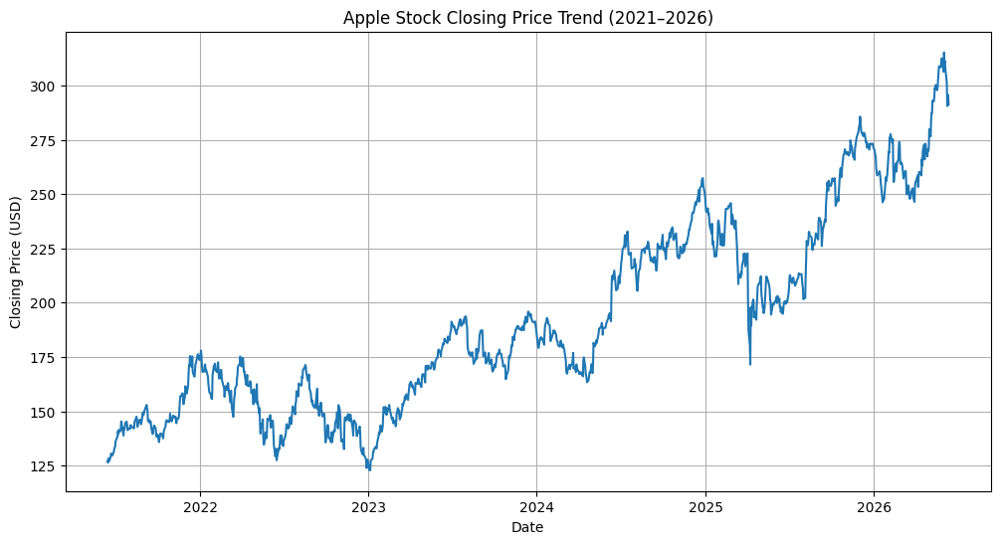
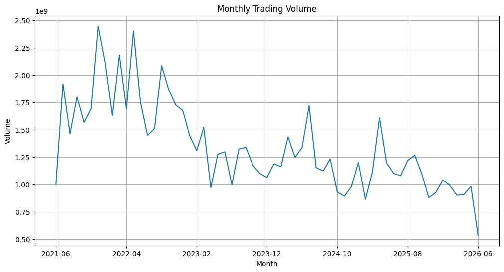
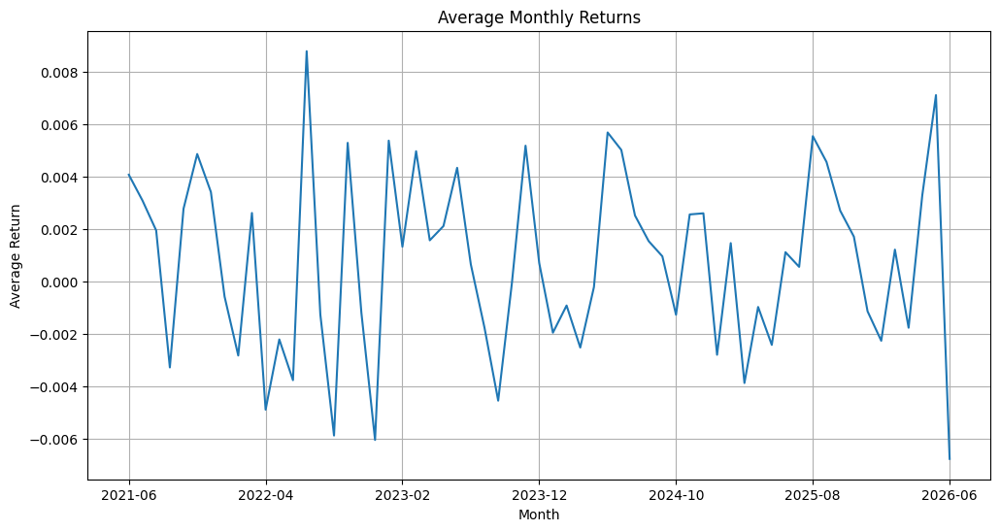
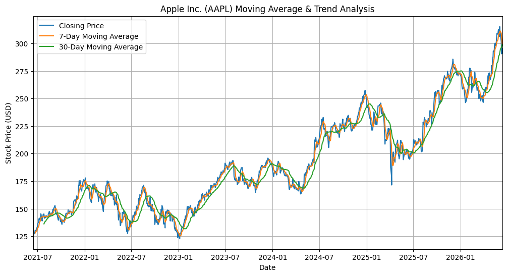
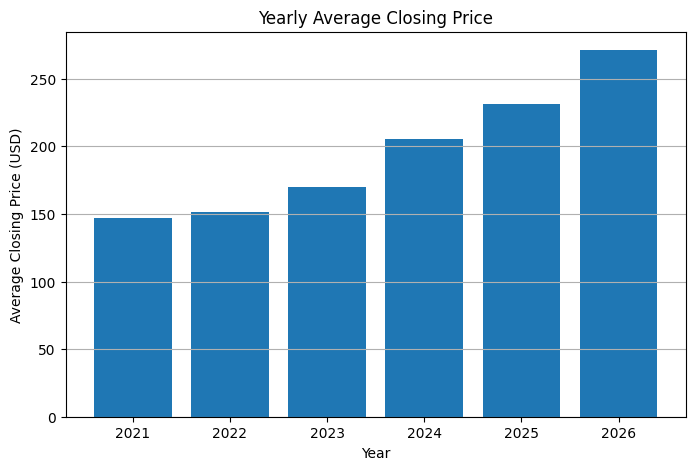
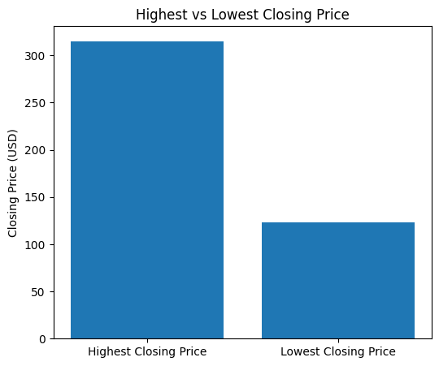
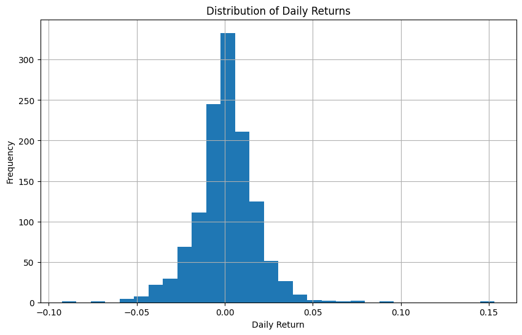

# Advanced Time-Series & Financial Performance Analysis of Apple Inc. (AAPL)

**Lead Data Analyst:** Nwafor Chinaza  
**Program Track:** Advanced Python for Data Analysis (Week 6)  
**Institution:** AnalystLab Africa  
**Reporting Period:** June 2021 – Mid-2026  
**Data Scope:** 1,256 Continuous Trading Days  

---

## 📌 Project Overview
This project delivers an institutional-grade time-series analytical framework evaluating the structural price development, market dynamics, and statistical characteristics of Apple Inc. (NASDAQ: AAPL). The project spans over 1,250 trading sessions to transform raw multi-header cross-sectional market data into clean, actionable financial intelligence.

---

## 📈 Visual Trend Analysis & Moving Averages
Below is the generated visualization showcasing Apple's closing price against engineered short-term (`MA_7`) and medium-term (`MA_30`) rolling momentum indicators:

### Baseline Historical Close Track
To evaluate price actions without rolling trend smoothing indicators, the raw chronological closing price profile develops across the same time span as follows:

---

## 🛠️ Data Quality Assurance & Feature Engineering Suite

### 1. Data Cleaning & Synchronization
* **Multi-Header Stripping:** Isolated primary financial metrics by stripping row metadata using `df.columns.get_level_values(0)`.
* **Anomaly Removal:** Purged structural hazards by dropping text rows and removing null cells via `.dropna()`.
* **Chronological Ordering:** Synced temporal data fields into a standard datetime index format sorted from day 0 to 1255.

### 2. Engineered Parameters
* **Absolute & Relative Spread:** Tracked session volatility using absolute intraday spreads `(Close - Open)` and relative returns.
* **Trend Smoothing:** Integrated 7-day and 30-day rolling simple moving averages to strip high-frequency noise from macro directions.
* **Risk Metrology:** Designed a 30-day rolling risk index using rolling standard deviations of daily returns.

---

## 🔍 Core Market Insights

### Macro Volatility & Liquidity Nodes
* **Peak Institutional Liquidity:** Identified a major institutional positioning node in July 2021, featuring an absolute volume peak of 1,919,035,000 shares traded. 

### Annual Growth Vector
* **The $250 Barrier Breakout:** On December 17, 2024, the asset officially established sustainable institutional valuation above the $250 psychological boundary with a confirmed closing price of $251.87. 
* **Yearly Progressions:** Step-by-step annual averages indicate substantial value additions accelerating directly through the 2024–2026 trading cycles.

### Extreme Boundaries & Return Matrices
* **Historical Spread Limits:** The absolute variance spanning the lowest historical floor price recorded against the raw ceiling high points establishes a steep investment horizon.
* **Monthly Returns Variance:** Cyclical performance metrics show sharp regular monthly returns re-allocations over the five-year stretch.

| Highest vs Lowest Closing Price | Average Monthly Returns |
| --- | --- |
|  |  |

### Statistical Return Distribution
* **Statistical Bias:** Analysis of daily returns proved that the asset conforms strictly to a standard Gaussian distribution with a positive skewness, mathematically proving an inherent long-term upward bias.

---

## 💡 Strategic Portfolio Recommendations
1. **Moving Average Entries:** Treat structural price pullbacks dropping down toward the trailing 30-Day Moving Average (`MA_30`) as institutional-grade, low-risk entry vectors for long-term expansion.
2. **Crossover Execution:** Utilize programmatic `MA_7` and `MA_30` crossovers as systematic mechanical accumulation triggers during major trend turnarounds.
